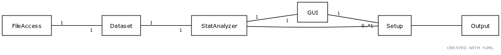
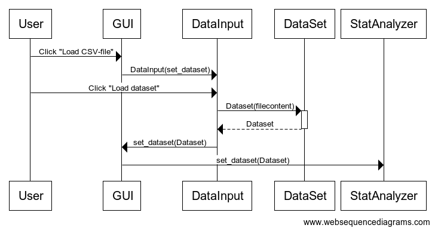
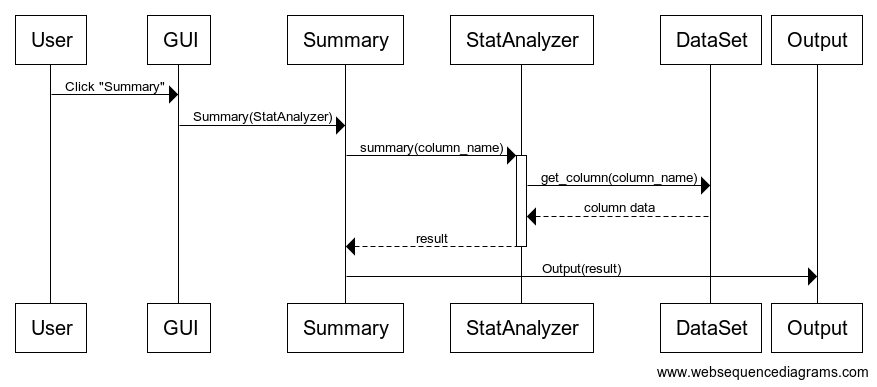

# Architecture

## Structure

Project structure:

- **/src**
    - main classes (StatAnalyzer, Dataset, FileAccess)
    - **/analyses**
        - Contains logic for analysis tasks
    - **/gui**
        * main classes for gui
        - **/analysis_setup**
            - Contains setup-vies for specific analysis jobs (extending the class Setup)
        - **/output_elements**
            - Classes for different type elements "outputs" are made of (header/text/table etc.)
    - **/math_helper**
        - Functions implementing some simple math
    - **/misc**
        - Miscellanious helper functions
    - **/tests**
        - Tests for the project
    - **/test_helpers**
        - Helpers for tests

        
##  User interface

The application has one main view that lists the possible analysis tasks for a dataset. 

Each of the analysis tasks have a distinct view for the setup (choose variable etc.). 

The output of the analysis tasks are displayed in a separate view. 

## Application logic

The main class responsible for application logic (statistical analysis) is StatAnalyzer. The GUI knows only one StatAnalyzer. 

The data is accessed through Dataset which provides getters for the actual data and metadata on columns (type of data).

Each "analysis task" (e.g. summary statistics or frequency table) has it's own implementation of the class "Setup" which calls the StatAnalyzer for the specific analysis and prints the output.

## Functionality

### Loading a dataset

### Summary statistics

