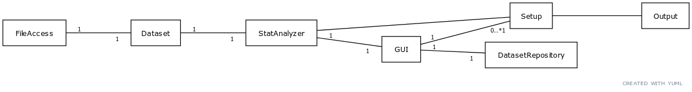

# Architecture

The main class responsible for application logic (statistical analysis) is StatAnalyzer. The GUI knows only one StatAnalyzer. 

The data is accessed through Dataset which provides getters for the actual data and metadata on columns (type of data).

Each "analysis task" (e.g. summary statistics or frequency table) has it's own implementation of the class "Setup" which calls the StatAnalyzer for the specific analysis and prints the output.

# Functionality

## Loading a dataset

## Summary statistics

