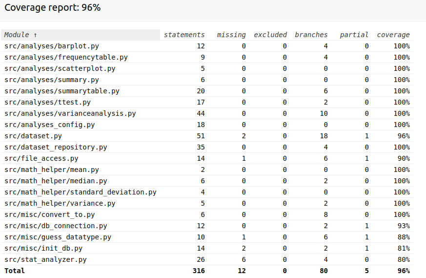

# Testing

Testing is implemented using the [unittest](https://docs.python.org/3/library/unittest.html) framework.

Only application logic is tested automatically. The ui has no tests and it was tested manually. 

## Unit/integration tests

Notes regarding unit and integration tests:
- The analysis functions and main classes are tested with unit tests. 
- Integration is through injection in StatAnalyzer
- Functions that create plots are tested by injecting a fake reference to the library that creates the plot. The tests test that the plotting function is called with the correct arguments. The plotting itself is assumed to work.
- Tests for classes `FileAccess` and `DataSet` depend on `./data/iris.csv`.

## Test coverage

## Functionality

All the of app functionality was tested manually trough the UI. 

Inserting invalid data (e.g. a letter where a number is expected) to all possible was tested manually.