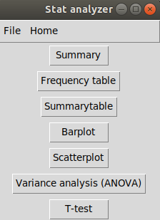
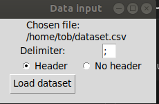
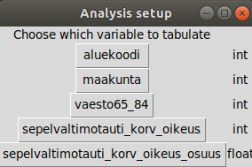
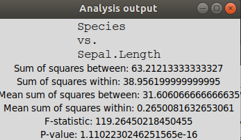

# User guide

## 1.  Setup and start the application

Run:
```bash
python3 -m pipenv install
python3 -m pipenv run start
```

## 2. Start by choosing the file to analyze

1. The application starts in the main view



2. From the "File"-dropdown menu click "Choose CSV-file". 

3. Browse and choose the file you want analyse

4. From the opening view (below), choose the delimiter of the file and whether or not it has a header row (first row of the file contains the names of the columns)



5. Click "Load dataset" and voilà the dataset is loaded

## 3. Choose which analysis task you want to perform

1. Choose one of the tasks by clicking one of the buttons (eg. Frequency table)

2. A setup view opens:



3. We'll choose "maakunta" by clicking it. This will do a frequency table of the variable "maakunta" and display the results:



4. Ruminate on the stats.