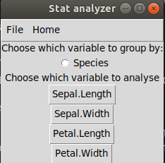

# User guide

## 1.  Setup and start the application

Run:
```bash
python3 -m pipenv install
python3 -m pipenv run build
python3 -m pipenv run start
```

## 2. Start by choosing the file to analyze

1. The application starts in the main view


2. From the "File"-dropdown menu click "Choose CSV-file". 

3. Browse and choose the file you want analyse

4. From the opening view (below), choose the delimiter of the file and whether or not it has a header row (first row of the file contains the names of the columns)


5. Click "Load dataset" and voilà the dataset is loaded

## 3. Choose which analysis task you want to perform

1. Choose one of the tasks by clicking one of the buttons. Let's choose ANOVA.

2. A setup view opens. In this example, we'll be using the example dataset, so the setup looks like this:



3. We want to test whether sepal length differs between species, so we'll choose "Species" and Sepal.Length. By clicking Sepal.Lenght, the analysis is done and the following statistics are displayed:


4. Ruminate on the stats.